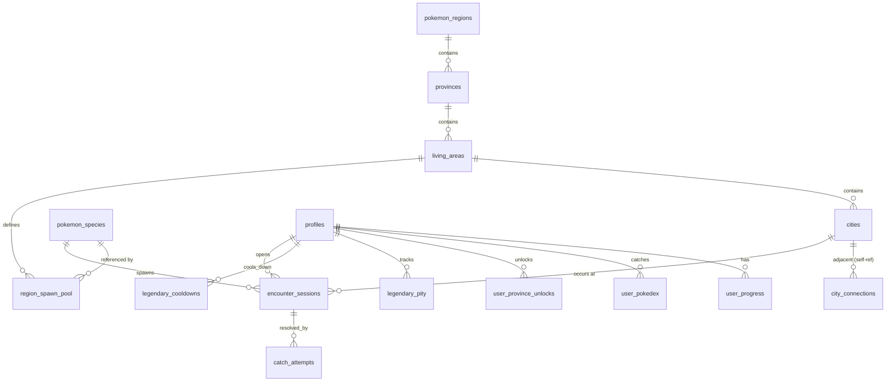

# DB.md — PokeMap 데이터베이스 설계

Supabase(PostgreSQL 15+) 기준. 스키마는 `public`. 원본 자료: `PokeMap_MainSystem.md`(핵심 시스템 규칙), `PokeMap_UISystem.md`(화면/등급 규칙), `MapMatching.md`(도→포켓몬지방 매칭), `pokemonRare.md`(스폰 풀 구성), `korea_living_areas.csv`(도/생활권/시군), `pokemon.csv`(포켓몬 배정, `build_pokemon_db.py` 산출물), `files/korea_map_data.json`(시군 경계 GeoJSON, 인접 그래프 산출용).

## 1. 용어 매핑

| 게임 용어 | DB 엔티티 | 비고 |
|---|---|---|
| 포켓몬 지방 (관동/성도/…) | `pokemon_regions` | 8개, Pokedex 표시용 분류 |
| 도 (서울/경기/…) | `provinces` | 17개, 이동 제한 없는 지역 구분 단위(섬 지역만 예외) |
| 생활권 | `living_areas` | 도 내부 세부 권역, 스폰 풀의 단위 |
| 시/군/구 | `cities` | 이동 최소 단위 |
| 등급(몬스터볼~마스터볼) | `v_user_tier` (뷰) | 유저 전체 포획률 기반, 별도 테이블 없음 |
| 전설 포켓몬 | `provinces.legendary_dex_no` + `cities.is_legendary_site` | 도당 1마리, 고정 시에 배치 |

## 2. ERD



## 3. 테이블 전체 목록

| 테이블 | 성격 | 쓰기 주체 |
|---|---|---|
| `profiles` | 유저 프로필 | 앱(유저 본인) |
| `pokemon_regions` | 8개 포켓몬 지방 마스터 | 시드 전용 |
| `provinces` | 17개 도 마스터(전설 포켓몬 지정 포함) | 시드 전용 |
| `living_areas` | 생활권 마스터 | 시드 전용 |
| `cities` | 시군 마스터(전설 출현지 플래그 포함) | 시드 전용 |
| `city_connections` | 시군 인접 그래프 | 시드 전용 |
| `pokemon_species` | 포켓몬 마스터(pokemon.csv) | 시드 전용 |
| `region_spawn_pool` | 생활권별 출현 포켓몬 배정 | 시드 전용 |
| `user_progress` | 유저 현재 위치(GPS 온보딩으로 초기화) | Edge Function |
| `user_province_unlocks` | 유저별 섬 지역(최종 히든) 해금 상태, 육지 도는 해금 개념 없음 | Edge Function |
| `legendary_cooldowns` | 전설 포획 재시도 쿨타임 | Edge Function |
| `legendary_pity` | 전설 포획 실패 누적(영구 확률 상승) | Edge Function |
| `encounter_sessions` | 인카운터 세션(격리 탭, 임시) | Edge Function |
| `catch_attempts` | 조우당 최대 3회 포획 시도 로그 | Edge Function |
| `user_pokedex` | 포획 확정 기록 | Edge Function |

## 4. 테이블 상세

### 4.1 `profiles`
| 컬럼 | 타입 | 제약 |
|---|---|---|
| `id` | uuid | PK, FK → `auth.users.id` ON DELETE CASCADE |
| `nickname` | text | UNIQUE NOT NULL, "트레이너 이름"으로 헤더에 노출 |
| `created_at` | timestamptz | DEFAULT now() |

### 4.2 `pokemon_regions`
| 컬럼 | 타입 | 제약 |
|---|---|---|
| `id` | smallint | PK |
| `name` | text | UNIQUE NOT NULL, 예: '관동지방' |

### 4.3 `provinces`
| 컬럼 | 타입 | 제약 |
|---|---|---|
| `id` | smallint | PK |
| `name` | text | UNIQUE NOT NULL, 예: '서울특별시' |
| `region_id` | smallint | FK → `pokemon_regions.id` NOT NULL |
| `legendary_dex_no` | smallint | FK → `pokemon_species.dex_no`, 도당 1마리(`pokemon.csv` 전설여부=Y 행) |
| `is_island_endgame` | boolean | NOT NULL DEFAULT false, 제주도/울릉도·독도 등 인접 도가 없는 최종 히든 지역 표시(§16) |

Index: `idx_provinces_region ON provinces(region_id)`

### 4.4 `living_areas`
| 컬럼 | 타입 | 제약 |
|---|---|---|
| `id` | int | PK |
| `province_id` | smallint | FK → `provinces.id` NOT NULL |
| `name` | text | NOT NULL, 예: '남부권' |
| `color` | text | NOT NULL, 지도 표시용 hex |
| `is_endgame_area` | boolean | NOT NULL DEFAULT false |

Constraint: `UNIQUE(province_id, name)`

`is_endgame_area`: 소속 도 전체가 아니라 **생활권 하나만** 최종 히든 지역으로 취급할 때 사용(§16). `provinces.is_island_endgame`은 도 전체가 엔드게임인 제주도 케이스만 표현 가능한데, 울릉도·독도(경상북도)와 옹진군(인천광역시)은 실제 행정구역상 별도 도가 아니라 정상 도에 속한 생활권 하나뿐이라 이 컬럼으로 표시한다. 소속 도의 나머지 생활권은 §14 그대로 이동 제한이 없다.

### 4.5 `cities`
| 컬럼 | 타입 | 제약 |
|---|---|---|
| `id` | int | PK |
| `living_area_id` | int | FK → `living_areas.id` NOT NULL |
| `name` | text | UNIQUE NOT NULL, 예: '수원시' |
| `centroid` | point | NOT NULL |
| `is_legendary_site` | boolean | NOT NULL DEFAULT false, 도당 정확히 1개 시만 true(도의 "상징적인 시") |

Index: `idx_cities_living_area ON cities(living_area_id)`. Constraint(앱 레벨 검증): 도(`living_area.province_id` 경유)당 `is_legendary_site=true` 행은 정확히 1개.

### 4.6 `city_connections`
시군 인접 그래프(상/하/좌/우 이동 UI의 실제 데이터). `files/korea_map_data.json` 폴리곤 경계 공유 여부로 배치 산출 후 시드.

| 컬럼 | 타입 | 제약 |
|---|---|---|
| `city_a_id` | int | FK → `cities.id` |
| `city_b_id` | int | FK → `cities.id` |

Constraint: `PRIMARY KEY(city_a_id, city_b_id)`, `CHECK(city_a_id < city_b_id)`. 조회는 `v_city_neighbors`(§7). 섬 지역(제주도 등)은 육지와 연결된 행이 없다 — 인접 이동만으로는 도달 자체가 불가능해 §16 최종 히든 지역이 별도 해금 조건을 갖는 이유.

### 4.7 `pokemon_species`
| 컬럼 | 타입 | 제약 |
|---|---|---|
| `dex_no` | smallint | PK |
| `name_en` | text | UNIQUE NOT NULL |
| `name_kr` | text | NOT NULL |
| `type1` | text | NOT NULL |
| `type2` | text | NULL 허용 |
| `bst` | smallint | NOT NULL |
| `flavor_text` | text | NULL 허용, 도감 상세 팝업용 설명(PokeAPI species flavor_text 등 별도 수집 필요 — 현재 `pokemon.csv`에는 없는 컬럼, 데이터 보강 필요) |
| `height_dm` | smallint | NULL 허용, 도감 상세 팝업용 키(PokeAPI `pokemon.height`, decimetre 단위 — `flavor_text`와 동일하게 `pokemon.csv`에 없어 별도 수집 필요) |
| `weight_hg` | smallint | NULL 허용, 도감 상세 팝업용 몸무게(PokeAPI `pokemon.weight`, hectogram 단위 — 별도 수집 필요) |
| `primary_ability` | text | NULL 허용, 도감 상세 팝업용 대표 특성 1개(PokeAPI `pokemon.abilities[0]` — 별도 수집 필요) |

### 4.8 `region_spawn_pool`
| 컬럼 | 타입 | 제약 |
|---|---|---|
| `id` | bigint | PK |
| `living_area_id` | int | FK → `living_areas.id` NOT NULL |
| `dex_no` | smallint | FK → `pokemon_species.dex_no` NOT NULL |
| `category` | text | NOT NULL, CHECK IN ('공통','고유') |
| `is_legendary` | boolean | NOT NULL DEFAULT false |

Constraint: `UNIQUE(living_area_id, dex_no)`. 전설(`is_legendary=true`) 행은 일반 스폰 판정(§12)에서 항상 제외 — 전설은 지도 위 고정 시 직접 조우로만 발생(§17).

### 4.9 `user_progress`
| 컬럼 | 타입 | 제약 |
|---|---|---|
| `user_id` | uuid | PK, FK → `profiles.id` |
| `current_city_id` | int | FK → `cities.id` NOT NULL |
| `updated_at` | timestamptz | DEFAULT now() |

최초값은 하드코딩이 아니라 회원가입 시 GPS 좌표를 `cities.centroid`와 최근접 매칭해 결정(`PRD.md` §6.1).

### 4.10 `user_province_unlocks`
| 컬럼 | 타입 | 제약 |
|---|---|---|
| `user_id` | uuid | FK → `profiles.id` |
| `province_id` | smallint | FK → `provinces.id` |
| `unlocked_at` | timestamptz | DEFAULT now() |

Constraint: `PRIMARY KEY(user_id, province_id)`. 육지 도는 이동 자체에 해금 조건이 없어 이 테이블에 행을 만들지 않는다 — `is_island_endgame=true`인 도(제주도/울릉도·독도)만 §16 조건 충족 시 삽입.

### 4.11 `legendary_cooldowns`
전설 포획 실패 후 재시도 잠금 — `next_available_at`이 여기 있다.

| 컬럼 | 타입 | 제약 |
|---|---|---|
| `user_id` | uuid | FK → `profiles.id` |
| `province_id` | smallint | FK → `provinces.id` |
| `next_available_at` | timestamptz | NOT NULL |

Constraint: `PRIMARY KEY(user_id, province_id)`. 전설 포획 3회 시도 모두 실패 시 `next_available_at = now() + interval '1 hour'` 기록, 그 전에는 해당 도의 전설 출현지(`is_legendary_site`)에 재진입해도 조우가 발생하지 않는다.

### 4.12 `legendary_pity`
전설 포획 실패마다 확률이 영구적으로 누적 상승(리셋 없음).

| 컬럼 | 타입 | 제약 |
|---|---|---|
| `user_id` | uuid | FK → `profiles.id` |
| `province_id` | smallint | FK → `provinces.id` |
| `fail_visits` | smallint | NOT NULL DEFAULT 0, 실패한 방문 횟수(성공하면 더 이상 증가하지 않음, 감소도 없음) |

Constraint: `PRIMARY KEY(user_id, province_id)`

### 4.13 `encounter_sessions`
격리 탭(Catch & Encounter)의 단일 세션. 이동으로 강제 진입하거나(일반), 전설 출현지 도착으로 진입한다(전설, 확률 판정 없이 확정 생성).

| 컬럼 | 타입 | 제약 |
|---|---|---|
| `id` | uuid | PK DEFAULT gen_random_uuid() |
| `user_id` | uuid | FK → `profiles.id` NOT NULL |
| `city_id` | int | FK → `cities.id` NOT NULL |
| `dex_no` | smallint | FK → `pokemon_species.dex_no` NOT NULL |
| `is_legendary` | boolean | NOT NULL DEFAULT false |
| `spawn_rate_used` | numeric(5,4) | NULL 허용(전설은 확률 판정이 없으므로 NULL) |
| `attempts_used` | smallint | NOT NULL DEFAULT 0, 최대 3 |
| `status` | text | NOT NULL DEFAULT 'pending', CHECK IN ('pending','caught','fled') |
| `expires_at` | timestamptz | NOT NULL DEFAULT now() + interval '2 minutes' |
| `created_at` | timestamptz | DEFAULT now() |

Index: `idx_encounter_user_status ON encounter_sessions(user_id, status)`

### 4.14 `catch_attempts`
조우 하나당 최대 3행(1~3회차).

| 컬럼 | 타입 | 제약 |
|---|---|---|
| `id` | bigint | PK |
| `session_id` | uuid | FK → `encounter_sessions.id` NOT NULL |
| `attempt_no` | smallint | NOT NULL, CHECK IN (1,2,3) |
| `catch_rate_used` | numeric(5,4) | NOT NULL |
| `success` | boolean | NOT NULL |
| `created_at` | timestamptz | DEFAULT now() |

Constraint: `UNIQUE(session_id, attempt_no)` — 같은 회차 중복 시도 방지.

### 4.15 `user_pokedex`
| 컬럼 | 타입 | 제약 |
|---|---|---|
| `user_id` | uuid | FK → `profiles.id` |
| `dex_no` | smallint | FK → `pokemon_species.dex_no` |
| `first_caught_at` | timestamptz | DEFAULT now() |
| `first_caught_city_id` | int | FK → `cities.id` NOT NULL |
| `catch_count` | int | NOT NULL DEFAULT 1 |

Constraint: `PRIMARY KEY(user_id, dex_no)`

## 5. Trigger

- `trg_pokedex_upsert` — `catch_attempts` INSERT AFTER, `success=true`이면 `user_pokedex` UPSERT(`catch_count += 1`) 및 `encounter_sessions.status='caught'`.
- `trg_session_flee` — `catch_attempts` INSERT AFTER, 해당 세션의 실패 횟수가 3에 도달하면 `encounter_sessions.status='fled'`. 세션이 전설(`is_legendary=true`)이면 `legendary_cooldowns` UPSERT(`next_available_at = now() + 1h`) 및 `legendary_pity.fail_visits += 1`.
- `trg_progress_touch` — `user_progress` UPDATE BEFORE, `updated_at = now()` 자동 갱신.

## 6. Function

### 6.1 `calc_spawn_rate(bst smallint) RETURNS numeric`
```sql
-- 일반 인카운터 발생 확률: 종족값 반비례, 5%~30% (PokeMap_MainSystem.md §3 원본 그대로)
CREATE FUNCTION calc_spawn_rate(bst smallint) RETURNS numeric AS $$
  SELECT GREATEST(0.05, LEAST(0.30,
    0.30 - (LEAST(GREATEST(bst, 200), 720) - 200)::numeric / (720 - 200) * 0.25
  ));
$$ LANGUAGE sql IMMUTABLE;
```

### 6.2 `calc_catch_rate(bst smallint) RETURNS numeric`
```sql
-- 일반 포켓몬 포획 확률(시도당): 종족값 반비례, 10%~90% (PokeMap_MainSystem.md §4 원본 그대로, 볼 종류 보정 없음)
CREATE FUNCTION calc_catch_rate(bst smallint) RETURNS numeric AS $$
  SELECT GREATEST(0.10, LEAST(0.90,
    0.90 - (LEAST(GREATEST(bst, 200), 720) - 200)::numeric / (720 - 200) * 0.80
  ));
$$ LANGUAGE sql IMMUTABLE;
```

### 6.3 `calc_legendary_catch_rate(fail_visits smallint) RETURNS numeric`
```sql
-- 전설 포켓몬: 기본 3%, 실패 방문마다 영구 +1%p 누적 (PokeMap_MainSystem.md §5 원본 그대로)
CREATE FUNCTION calc_legendary_catch_rate(fail_visits smallint) RETURNS numeric AS $$
  SELECT LEAST(1.0, 0.03 + fail_visits * 0.01);
$$ LANGUAGE sql IMMUTABLE;
```

### 6.4 `check_endgame_unlock(p_user_id uuid) RETURNS boolean`
`is_island_endgame=false`인 모든 도가 100% 포획 완료(`v_user_province_progress`)이면 true — 제주도 해금 조건(`PokeMap_MainSystem.md` §2). 육지 도는 해금 조건 자체가 없어(§14) 이 함수의 대상이 아니다.

이 결과는 `provinces.is_island_endgame=true`인 도뿐 아니라 `living_areas.is_endgame_area=true`인 생활권(울릉권/옹진군, §16)의 이동 가능 여부에도 동일하게 사용된다 — 게이트 조건 자체는 하나(`check_endgame_unlock`)이고, 무엇을 잠그느냐(도 전체 vs 생활권 하나)만 다르다.

### 6.5 `bootstrap_user(p_user_id uuid, p_nickname text, p_lat double precision, p_lng double precision) RETURNS TABLE(city_id int, city_name text, fallback boolean)`

GPS 온보딩용. `SECURITY DEFINER`(owner=postgres)로 RLS를 우회해 `profiles`와 `user_progress`를 한 트랜잭션으로 생성한다(`bootstrap-location` Edge Function 전용, service_role만 EXECUTE — anon/authenticated 권한은 회수). 시작 도시는 좌표가 유효하면 육지 도의 최근접 `centroid`(`point(lng, lat)` 순서), 아니면 서울(id=1). `profiles`는 같은 `user_id` 재시도면 멱등(기존 유지), 다른 유저가 닉네임을 선점했으면 `NICKNAME_TAKEN` 예외. `fallback`은 서울 기본값으로 폴백했는지 여부.

### 6.6 `calc_user_tier(p_user_id uuid) RETURNS text`
전체 포켓몬(도 구분 없이) 대비 유저 포획률로 등급 산출. 임계값은 가정치이며 밸런스 조정 시 `PRD.md` §14 갱신 필요.
```sql
CREATE FUNCTION calc_user_tier(p_user_id uuid) RETURNS text AS $$
  SELECT CASE
    WHEN pct >= 0.90 THEN '마스터볼'
    WHEN pct >= 0.60 THEN '하이퍼볼'
    WHEN pct >= 0.30 THEN '슈퍼볼'
    ELSE '몬스터볼'
  END
  FROM (
    SELECT COUNT(*)::numeric / (SELECT COUNT(*) FROM pokemon_species) AS pct
    FROM user_pokedex WHERE user_id = p_user_id
  ) t;
$$ LANGUAGE sql STABLE;
```

## 7. View

- `v_city_neighbors` — `city_connections` 양방향 전개.
- `v_user_province_progress` — 유저별 도별 포획 수 / 배정 수(전설 제외, 일반종 기준). `check_endgame_unlock`, 전설 출현 조건(§15), Pokedex 진행률 표시에 재사용.
- `v_user_tier` — `calc_user_tier`를 유저 목록에 대해 미리 계산해 헤더 렌더링 시 재계산 비용을 줄이는 캐시 뷰(머티리얼라이즈드 뷰 후보, 트래픽 증가 시 전환).

## 8. RLS & Policy

RLS 전부 활성화. 마스터 테이블(`pokemon_regions`, `provinces`, `living_areas`, `cities`, `city_connections`, `pokemon_species`, `region_spawn_pool`)은 `FOR SELECT USING (true)`만 존재.

유저 데이터 테이블(`user_progress`, `user_province_unlocks`, `legendary_cooldowns`, `legendary_pity`, `encounter_sessions`, `catch_attempts`, `user_pokedex`) 공통:

```sql
CREATE POLICY select_own ON user_pokedex FOR SELECT USING (auth.uid() = user_id);
CREATE POLICY no_direct_write ON user_pokedex FOR ALL USING (false) WITH CHECK (false);
```

클라이언트는 SELECT만, 모든 쓰기는 `service_role`을 쓰는 Edge Function 경유 — 스폰/포획/전설 확률 조작을 서버에서 강제.

## 9. Edge Function 역할

| 함수 | 트리거 | 역할 |
|---|---|---|
| `bootstrap-location` | 회원가입 직후(GPS 좌표 전달) | JWT로 요청자 확인 → 닉네임 검증 → 좌표를 육지 도(`is_island_endgame=false`) `cities.centroid`와 최근접 매칭(좌표 null/무효 시 서울 id=1 폴백) → `bootstrap_user` RPC로 `profiles`+`user_progress`를 원자 생성. `profiles`는 `no_direct_write` RLS라 이 함수(service_role)가 유일한 생성 경로다. |
| `move-city` | Map에서 인접 시 이동 | 인접성 검증(육지 도는 해금 검증 없음, 섬 지역은 `is_island_endgame=true`이고 `user_province_unlocks` 미해금이면 거부, 목적지 생활권이 `is_endgame_area=true`이면 동일하게 `check_endgame_unlock` 미충족 시 거부) → 목적지가 `is_legendary_site`이고 해당 도 100% 완료면 전설 세션 확정 생성 → 아니면 `calc_spawn_rate` 판정 → `encounter_sessions` 생성 여부 결정 → `user_progress` 갱신 → `unlock-check` 호출 |
| `catch-attempt` | Catch&Encounter 탭에서 던지기(회차별) | 세션 유효성 검증 → `attempt_no` 순번 검증 → 일반은 `calc_catch_rate`, 전설은 `calc_legendary_catch_rate(fail_visits)` 판정 → `catch_attempts` 삽입 |
| `unlock-check` | `move-city` 내부 호출 | `check_endgame_unlock`으로 섬 지역만 재평가(육지 도는 재평가 대상 아님) |
| `session-sweep` | Cron(5분) | 만료된 `encounter_sessions`를 `fled` 처리, 만료된 `legendary_cooldowns` 정리 |

## 10. Transaction 설계

**`move-city`**:
1. `SELECT ... FOR UPDATE` on `user_progress`
2. 인접성 검증. 목적지가 섬 지역(`is_island_endgame=true`)이면 `user_province_unlocks` 해금 여부 추가 검증(미해금이면 거부), 목적지 생활권이 `is_endgame_area=true`(울릉권/옹진군)이면 `check_endgame_unlock`을 그 자리에서 재평가해 미충족 시 거부 — 육지 도의 나머지 생활권은 해금 검증 없음
3. 목적지가 전설 출현지이고 해당 도 진행률 100%이며 `legendary_cooldowns.next_available_at`이 지났으면 → `is_legendary=true` 세션 생성(확률 판정 없음)
4. 그 외에는 `calc_spawn_rate` 판정 → 성공 시 일반 세션 생성
5. `user_progress.current_city_id` 갱신, 커밋
6. 커밋 후 `unlock-check` 실행

**`catch-attempt`**:
1. `SELECT ... FOR UPDATE` on `encounter_sessions`
2. `status='pending' AND expires_at > now()` 확인, `attempts_used < 3` 확인
3. 확률 판정(§6.2/6.3) → `catch_attempts` INSERT(`attempt_no = attempts_used + 1`), `encounter_sessions.attempts_used += 1`
4. 트리거가 성공/3회 소진에 따라 `status` 확정
5. 커밋

## 11. Lock 전략

- 유저 단위 행 잠금(`FOR UPDATE`)만 사용, 테이블 전체 락 없음.
- 항상 `user_progress` → `encounter_sessions` 순서로만 잠금 획득(역순 금지, 데드락 방지).

## 12. Spawn 계산

이동 도착 시(전설 조건 미충족 상황) 도착 생활권의 일반 스폰 풀(공통 3 + 고유 5)에서 각 항목에 대해 `calc_spawn_rate(bst)` 독립 판정, 첫 성공을 스폰. 전부 실패하면 인카운터 없음.

## 13. Capture 계산

일반 포켓몬: 조우당 최대 3회, 각 회차 `calc_catch_rate(bst)`로 독립 판정(회차 간 확률 변화 없음). 첫 성공 시 즉시 확정, 3회 모두 실패 시 도망.

전설 포켓몬: 확률 판정 없이 조우 자체는 확정 발생, 포획 확률만 §6.3으로 매 방문마다 재계산(누적 `fail_visits` 반영).

### 13.1 포획 가능성 tier (클라이언트 노출용)

Catch & Encounter 탭의 "포획 가능성" 태그(`DESIGN.md` §2.2)는 원시 확률(%)이 아니라 서버가 계산한 4단계 tier만 클라이언트로 내려준다 — `CLAUDE.md` §22 "클라이언트 확률 계산/노출 금지"는 클라이언트가 직접 `calc_catch_rate`를 계산하거나 정확한 %를 아는 것을 막는 것이지, tier 자체를 감추라는 뜻은 아니다.

- `calc_catch_rate_tier(rate numeric) RETURNS text`: `calc_catch_rate(bst)` 결과를 4구간(잠정치, §17 임계값과 동일하게 밸런스 확정 전 가정치)으로 매핑.

| tier | 구간 |
|---|---|
| 매우 낮음 | rate < 0.30 |
| 낮음 | 0.30 ≤ rate < 0.50 |
| 보통 | 0.50 ≤ rate < 0.70 |
| 높음 | rate ≥ 0.70 |

- `move-city` 응답(세션 생성 시)과 격리 탭 진입 시 세션 조회 응답에 `catch_rate_tier`만 포함, `catch_rate` 원시값은 절대 포함하지 않는다. 전설 조우는 §6.3 결과를 동일 함수로 매핑.

## 14. Unlock 계산

육지 도(`is_island_endgame=false`)는 해금 조건이 없다 — 인접 시로 이동 가능하면 도 경계와 무관하게 바로 이동된다. 해금 개념은 §16 최종 히든 지역(섬 지역 도 전체, 그리고 정상 도 안에 섞여 있는 엔드게임 생활권)에만 남아 있다.

## 15. Legendary 계산

- 도감 100% 완공 시 지도에 해당 도의 전설 출현지(`is_legendary_site` 시)가 노출.
- 그 시로 이동하면 스폰 확률 판정 없이 곧바로 전설 조우 세션 생성(`legendary_cooldowns`가 만료된 경우에만).
- 포획 확률 = `calc_legendary_catch_rate(legendary_pity.fail_visits)`, 3회 시도 내 미포획 시 `legendary_pity.fail_visits += 1`, `legendary_cooldowns.next_available_at = now() + 1h`.
- 포획 성공 시 더 이상 해당 도의 전설 관련 카운터를 갱신할 필요 없음(재도전 없음).

## 16. 최종 히든 지역 (제주도 / 울릉도·독도·옹진군)

최종 히든 지역 게이트는 **두 단계**로 존재한다 — 도 전체가 엔드게임인 경우(`provinces.is_island_endgame`)와, 정상 도 안에 엔드게임 전용 생활권 하나만 섞여 있는 경우(`living_areas.is_endgame_area`, §4.4).

- **제주도(도 단위)**: `provinces.is_island_endgame=true`인 도는 `city_connections`상 육지와 연결되지 않아(§4.6) 인접 이동으로는 도달할 수 없다. `check_endgame_unlock`: `is_island_endgame=false`인 모든 도가 100% 완료되어야 해금. 현재 `is_island_endgame=true`인 도는 제주도뿐이다.
- **울릉도·독도(생활권 단위)**: 실제 행정구역상 경상북도 소속이라(§1 "도=실제 행정구역" 원칙) 별도 도로 만들지 않고, 경상북도 소속 생활권 `울릉권`(시 `울릉군`, 독도는 별도 시 엔티티 없이 포함)으로 시드하고 `living_areas.is_endgame_area=true`로 표시했다 — **더 이상 데이터 갭이 아니다.** 경상북도의 나머지 생활권은 평소대로 자유 이동, `울릉권`만 `check_endgame_unlock` 충족 전까지 이동 거부.
  - `울릉군`은 `city_connections`에 인접 시가 없다(육지-도서 간 다리가 없어 §12 인접 그래프 계산 결과 고립) — 어차피 인접 이동으로는 못 오므로, `is_endgame_area` 게이트는 "언젠가 조건 충족 후 열어주는" 스위치 역할만 한다.
- **옹진군(생활권 단위)**: 인천광역시 소속의 별도 생활권으로 동일하게 `is_endgame_area=true` — 서해 도서 지역(백령도·연평도 등)이라 육지 연결이 없는 것도 울릉권과 동일하다.

## 17. `next_available_at` 상세

- `legendary_cooldowns.next_available_at`에만 존재하는 컬럼 — 전설 포획 3회 실패 후 재도전까지의 1시간 잠금을 표현한다(`PokeMap_MainSystem.md` §5).
- 일반 포켓몬 인카운터에는 이동 쿨다운이 없다 — 이동할 때마다 매번 새로 스폰 판정을 시도한다(원본 문서에 일반 이동 쿨다운 규정 없음).
- 만료 여부는 조회 시점에 `now()`와 비교, `session-sweep`은 저장공간 정리용일 뿐 로직에 필수는 아니다.
