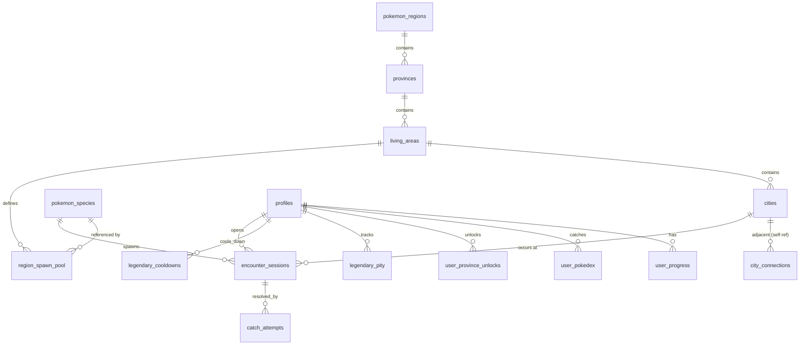

# DB.md — PokeMap 데이터베이스 설계

Supabase(PostgreSQL 15+) 기준. 스키마는 `public`. 원본 자료: `PokeMap_MainSystem.md`(핵심 시스템 규칙), `PokeMap_UISystem.md`(화면/등급 규칙), `MapMatching.md`(도→포켓몬지방 매칭), `pokemonRare.md`(스폰 풀 구성), `korea_living_areas.csv`(도/생활권/시군), `pokemon.csv`(포켓몬 배정, `build_pokemon_db.py` 산출물), `files/korea_map_data.json`(시군 경계 GeoJSON, 인접 그래프 산출용).

## 1. 용어 매핑

| 게임 용어 | DB 엔티티 | 비고 |
|---|---|---|
| 포켓몬 지방 (관동/성도/…) | `pokemon_regions` | 8개, Pokedex 표시용 분류 |
| 도 (서울/경기/…) | `provinces` | 17개, 이동 제한 없는 지역 구분 단위(섬 지역만 예외) |
| 생활권 | `living_areas` | 도 내부 세부 권역, 스폰 풀의 단위 |
| 시/군/구 | `cities` | 이동 최소 단위 |
| 광역시/특별시 내부 구역 | `cities`(구 이름 4묶음, 동일 `living_area_id` 공유) | 이동만 세분화, 스폰 풀은 시 단위 그대로(§4.5) |
| 등급(몬스터볼~마스터볼) | `v_user_tier` (뷰) | 유저 전체 포획률 기반, 별도 테이블 없음 |
| 전설 포켓몬 | `provinces.legendary_dex_no` + `cities.is_legendary_site` | 도당 1마리, 고정 시에 배치 |

## 2. ERD



## 3. 테이블 전체 목록

| 테이블 | 성격 | 쓰기 주체 |
|---|---|---|
| `profiles` | 유저 프로필 | 앱(유저 본인) |
| `pokemon_regions` | 8개 포켓몬 지방 마스터 | 시드 전용 |
| `provinces` | 17개 도 마스터(전설 포켓몬 지정 포함) | 시드 전용 |
| `living_areas` | 생활권 마스터 | 시드 전용 |
| `cities` | 시군 마스터(전설 출현지 플래그 포함) | 시드 전용 |
| `city_connections` | 시군 인접 그래프 | 시드 전용 |
| `pokemon_species` | 포켓몬 마스터(pokemon.csv) | 시드 전용 |
| `region_spawn_pool` | 생활권별 출현 포켓몬 배정 | 시드 전용 |
| `user_progress` | 유저 현재 위치(GPS 온보딩으로 초기화) | Edge Function |
| `user_province_unlocks` | 유저별 섬 지역(최종 히든) 해금 상태, 육지 도는 해금 개념 없음 | Edge Function |
| `legendary_cooldowns` | 전설 포획 재시도 쿨타임 | Edge Function |
| `legendary_pity` | 전설 포획 실패 누적(영구 확률 상승) | Edge Function |
| `encounter_sessions` | 인카운터 세션(격리 탭, 임시) | Edge Function |
| `catch_attempts` | 조우당 최대 3회 포획 시도 로그 | Edge Function |
| `user_pokedex` | 포획 확정 기록 | Edge Function |

## 4. 테이블 상세

### 4.1 `profiles`
| 컬럼 | 타입 | 제약 |
|---|---|---|
| `id` | uuid | PK, FK → `auth.users.id` ON DELETE CASCADE |
| `nickname` | text | UNIQUE NOT NULL, "트레이너 이름"으로 헤더에 노출 |
| `created_at` | timestamptz | DEFAULT now() |

### 4.2 `pokemon_regions`
| 컬럼 | 타입 | 제약 |
|---|---|---|
| `id` | smallint | PK |
| `name` | text | UNIQUE NOT NULL, 예: '관동지방' |

### 4.3 `provinces`
| 컬럼 | 타입 | 제약 |
|---|---|---|
| `id` | smallint | PK |
| `name` | text | UNIQUE NOT NULL, 예: '서울특별시' |
| `region_id` | smallint | FK → `pokemon_regions.id` NOT NULL |
| `legendary_dex_no` | smallint | FK → `pokemon_species.dex_no`, 도당 1마리(`pokemon.csv` 전설여부=Y 행) |
| `is_island_endgame` | boolean | NOT NULL DEFAULT false, 제주도/울릉도·독도 등 인접 도가 없는 최종 히든 지역 표시(§16) |

Index: `idx_provinces_region ON provinces(region_id)`

### 4.4 `living_areas`
| 컬럼 | 타입 | 제약 |
|---|---|---|
| `id` | int | PK |
| `province_id` | smallint | FK → `provinces.id` NOT NULL |
| `name` | text | NOT NULL, 예: '남부권' |
| `color` | text | NOT NULL, 지도 표시용 hex |
| `is_endgame_area` | boolean | NOT NULL DEFAULT false, 도 전체가 아니라 생활권 하나만 최종 히든 지역인 경우(울릉권 37, 옹진군 36 — 마이그레이션 `20260716200001`). §16 게이트와 §7 진행률 뷰 제외 대상 |
| `region_id_override` | smallint | NULL 허용, FK → `pokemon_regions.id`. 소속 도의 `region_id`를 생활권 단위로 덮어씀 — 울릉권/옹진군은 7(알로라지방). `20260716200000`에서 legacy로 드랍됐다가 `20260722000000`에서 재추가 |

Constraint: `UNIQUE(province_id, name)`

`is_endgame_area`: 소속 도 전체가 아니라 **생활권 하나만** 최종 히든 지역으로 취급할 때 사용(§16). `provinces.is_island_endgame`은 도 전체가 엔드게임인 제주도 케이스만 표현 가능한데, 울릉도·독도(경상북도)와 옹진군(인천광역시)은 실제 행정구역상 별도 도가 아니라 정상 도에 속한 생활권 하나뿐이라 이 컬럼으로 표시한다. 소속 도의 나머지 생활권은 §14 그대로 이동 제한이 없다.

### 4.5 `cities`
| 컬럼 | 타입 | 제약 |
|---|---|---|
| `id` | int | PK |
| `living_area_id` | int | FK → `living_areas.id` NOT NULL |
| `name` | text | UNIQUE NOT NULL, 예: '수원시' |
| `centroid` | point | NOT NULL |
| `is_legendary_site` | boolean | NOT NULL DEFAULT false, 도당 정확히 1개 시만 true(도의 "상징적인 시") |

Index: `idx_cities_living_area ON cities(living_area_id)`. Constraint(앱 레벨 검증): 도(`living_area.province_id` 경유)당 `is_legendary_site=true` 행은 정확히 1개.

**광역시/특별시 구역 분할**(서울/부산/대구/인천/광주/대전/울산 7곳, 세종은 구가 1개뿐이라 제외): 기존 시 전체를 나타내던 단일 `cities` 행 하나를 그대로 "구역A"로 유지(id·`is_legendary_site`·외부 `city_connections` 승계)하고, 구역B/C/D를 구 이름 4묶음(`files/korea_map_data.json`의 `counties[]`를 실제 경계 데이터 없이 그룹핑, `korea_map_data.json` 수동 편집 금지 원칙과 무관 — 폴리곤은 그대로, `cities.name`만 추가) 기준으로 신규 삽입한다. 4개 모두 동일 `living_area_id`를 공유하므로 `region_spawn_pool` 조회(§10.1)는 변경 없음. 구역 간 이동은 `city_connections`에 4개 구역 전원 완전 그래프(6쌍)로 추가하고, 외부(타 시/도)로의 연결은 구역A만 유지한다 — 즉 광역시 진입/이탈은 구역A를 경유해야 한다.

온보딩 수동 선택(`LoginForm.tsx`)의 시/군/구 드롭다운은 이 7개 광역시 도 선택 시 구역A(`is_legendary_site=true`)만 노출한다 — 신규 유저는 분할 이전과 동일한 굵기로 시작하고, 구역B/C/D는 입장 후 지도 이동으로만 도달한다.

### 4.6 `city_connections`
시군 인접 그래프(상/하/좌/우 이동 UI의 실제 데이터). `files/korea_map_data.json` 폴리곤 경계 공유 여부로 배치 산출 후 시드.

| 컬럼 | 타입 | 제약 |
|---|---|---|
| `city_a_id` | int | FK → `cities.id` |
| `city_b_id` | int | FK → `cities.id` |

Constraint: `PRIMARY KEY(city_a_id, city_b_id)`, `CHECK(city_a_id < city_b_id)`. 조회는 `v_city_neighbors`(§7). 섬 지역은 실제 여객 항로를 따라 육지와 연결 행을 갖는다(완도군↔제주시, 포항시↔울릉군, 울릉군↔독도, 인천광역시↔옹진군, 마이그레이션 `20260722000000`) — `fn_move_city` 인접성 검증(§10.1 2단계)이 잠금 게이트보다 먼저 수행되므로, 연결 행이 없으면 해금 후에도 도달이 불가능하다. 도달 차단은 연결 부재가 아니라 `REGION_LOCKED` 게이트(§16)가 담당한다.

### 4.7 `pokemon_species`
| 컬럼 | 타입 | 제약 |
|---|---|---|
| `dex_no` | smallint | PK |
| `name_en` | text | UNIQUE NOT NULL |
| `name_kr` | text | NOT NULL |
| `type1` | text | NOT NULL |
| `type2` | text | NULL 허용 |
| `bst` | smallint | NOT NULL |
| `flavor_text` | text | NULL 허용, 도감 상세 팝업용 설명(PokeAPI species flavor_text 등 별도 수집 필요 — 현재 `pokemon.csv`에는 없는 컬럼, 데이터 보강 필요) |
| `height_dm` | smallint | NULL 허용, 도감 상세 팝업용 키(PokeAPI `pokemon.height`, decimetre 단위 — `flavor_text`와 동일하게 `pokemon.csv`에 없어 별도 수집 필요) |
| `weight_hg` | smallint | NULL 허용, 도감 상세 팝업용 몸무게(PokeAPI `pokemon.weight`, hectogram 단위 — 별도 수집 필요) |
| `primary_ability` | text | NULL 허용, 도감 상세 팝업용 대표 특성 1개(PokeAPI `pokemon.abilities[0]` — 별도 수집 필요) |

### 4.8 `region_spawn_pool`
| 컬럼 | 타입 | 제약 |
|---|---|---|
| `id` | bigint | PK |
| `living_area_id` | int | FK → `living_areas.id` NOT NULL |
| `dex_no` | smallint | FK → `pokemon_species.dex_no` NOT NULL |
| `category` | text | NOT NULL, CHECK IN ('공통','고유') |
| `is_legendary` | boolean | NOT NULL DEFAULT false |

Constraint: `UNIQUE(living_area_id, dex_no)`. 전설(`is_legendary=true`) 행은 일반 스폰 판정(§12)에서 항상 제외 — 전설은 지도 위 고정 시 직접 조우로만 발생(§17).

### 4.9 `user_progress`
| 컬럼 | 타입 | 제약 |
|---|---|---|
| `user_id` | uuid | PK, FK → `profiles.id` |
| `current_city_id` | int | FK → `cities.id` NOT NULL |
| `updated_at` | timestamptz | DEFAULT now() |

최초값은 하드코딩이 아니라 회원가입 시 GPS 좌표를 `cities.centroid`와 최근접 매칭해 결정(`PRD.md` §6.1).

### 4.10 `user_province_unlocks`
| 컬럼 | 타입 | 제약 |
|---|---|---|
| `user_id` | uuid | FK → `profiles.id` |
| `province_id` | smallint | FK → `provinces.id` |
| `unlocked_at` | timestamptz | DEFAULT now() |

Constraint: `PRIMARY KEY(user_id, province_id)`. 육지 도는 이동 자체에 해금 조건이 없어 이 테이블에 행을 만들지 않는다 — `is_island_endgame=true`인 도(제주도)만 §16 조건 충족 시 삽입. 이동 게이트는 이 테이블이 아니라 `check_endgame_unlock`을 직접 평가하며(마이그레이션 `20260722000000`, 생활권 단위 endgame인 울릉권/옹진군은 소속 도가 육지라 행이 생기지 않기 때문), 이 행은 지도 잠금 표시용 기록이다.

### 4.11 `legendary_cooldowns`
전설 포획 실패 후 재시도 잠금 — `next_available_at`이 여기 있다.

| 컬럼 | 타입 | 제약 |
|---|---|---|
| `user_id` | uuid | FK → `profiles.id` |
| `province_id` | smallint | FK → `provinces.id` |
| `next_available_at` | timestamptz | NOT NULL |

Constraint: `PRIMARY KEY(user_id, province_id)`. 전설 포획 3회 시도 모두 실패 시 `next_available_at = now() + interval '1 hour'` 기록, 그 전에는 해당 도의 전설 출현지(`is_legendary_site`)에 재진입해도 조우가 발생하지 않는다.

### 4.12 `legendary_pity`
전설 포획 실패마다 확률이 영구적으로 누적 상승(리셋 없음).

| 컬럼 | 타입 | 제약 |
|---|---|---|
| `user_id` | uuid | FK → `profiles.id` |
| `province_id` | smallint | FK → `provinces.id` |
| `fail_visits` | smallint | NOT NULL DEFAULT 0, 실패한 방문 횟수(성공하면 더 이상 증가하지 않음, 감소도 없음) |

Constraint: `PRIMARY KEY(user_id, province_id)`

### 4.13 `encounter_sessions`
격리 탭(Catch & Encounter)의 단일 세션. 이동으로 강제 진입하거나(일반), 전설 출현지 도착으로 진입한다(전설, 확률 판정 없이 확정 생성).

| 컬럼 | 타입 | 제약 |
|---|---|---|
| `id` | uuid | PK DEFAULT gen_random_uuid() |
| `user_id` | uuid | FK → `profiles.id` NOT NULL |
| `city_id` | int | FK → `cities.id` NOT NULL |
| `dex_no` | smallint | FK → `pokemon_species.dex_no` NOT NULL |
| `is_legendary` | boolean | NOT NULL DEFAULT false |
| `spawn_rate_used` | numeric(5,4) | NULL 허용(전설은 확률 판정이 없으므로 NULL) |
| `attempts_used` | smallint | NOT NULL DEFAULT 0, 최대 3 |
| `status` | text | NOT NULL DEFAULT 'pending', CHECK IN ('pending','caught','fled') |
| `expires_at` | timestamptz | NOT NULL DEFAULT now() + interval '2 minutes' |
| `created_at` | timestamptz | DEFAULT now() |

Index: `idx_encounter_user_status ON encounter_sessions(user_id, status)`

### 4.14 `catch_attempts`
조우 하나당 최대 3행(1~3회차).

| 컬럼 | 타입 | 제약 |
|---|---|---|
| `id` | bigint | PK |
| `session_id` | uuid | FK → `encounter_sessions.id` NOT NULL |
| `attempt_no` | smallint | NOT NULL, CHECK IN (1,2,3) |
| `catch_rate_used` | numeric(5,4) | NOT NULL |
| `success` | boolean | NOT NULL |
| `created_at` | timestamptz | DEFAULT now() |

Constraint: `UNIQUE(session_id, attempt_no)` — 같은 회차 중복 시도 방지.

### 4.15 `user_pokedex`
| 컬럼 | 타입 | 제약 |
|---|---|---|
| `user_id` | uuid | FK → `profiles.id` |
| `dex_no` | smallint | FK → `pokemon_species.dex_no` |
| `first_caught_at` | timestamptz | DEFAULT now() |
| `first_caught_city_id` | int | FK → `cities.id` NOT NULL |
| `catch_count` | int | NOT NULL DEFAULT 1 |

Constraint: `PRIMARY KEY(user_id, dex_no)`

## 5. Trigger

- `trg_pokedex_upsert` — `catch_attempts` INSERT AFTER, `success=true`이면 `user_pokedex` UPSERT(`catch_count += 1`) 및 `encounter_sessions.status='caught'`.
- `trg_session_flee` — `catch_attempts` INSERT AFTER, 해당 세션의 실패 횟수가 3에 도달하면 `encounter_sessions.status='fled'`. 세션이 전설(`is_legendary=true`)이면 `legendary_cooldowns` UPSERT(`next_available_at = now() + 1h`) 및 `legendary_pity.fail_visits += 1`.
- `trg_progress_touch` — `user_progress` UPDATE BEFORE, `updated_at = now()` 자동 갱신.

## 6. Function

### 6.1 `calc_spawn_rate(bst smallint) RETURNS numeric`
```sql
-- 일반 인카운터 발생 확률: 종족값 반비례, 5%~30% (PokeMap_MainSystem.md §3 원본 그대로)
CREATE FUNCTION calc_spawn_rate(bst smallint) RETURNS numeric AS $$
  SELECT GREATEST(0.05, LEAST(0.30,
    0.30 - (LEAST(GREATEST(bst, 200), 720) - 200)::numeric / (720 - 200) * 0.25
  ));
$$ LANGUAGE sql IMMUTABLE;
```

### 6.2 `calc_catch_rate(bst smallint) RETURNS numeric`
```sql
-- 일반 포켓몬 포획 확률(시도당): 종족값 반비례, 10%~90% (PokeMap_MainSystem.md §4 원본 그대로, 볼 종류 보정 없음)
CREATE FUNCTION calc_catch_rate(bst smallint) RETURNS numeric AS $$
  SELECT GREATEST(0.10, LEAST(0.90,
    0.90 - (LEAST(GREATEST(bst, 200), 720) - 200)::numeric / (720 - 200) * 0.80
  ));
$$ LANGUAGE sql IMMUTABLE;
```

### 6.3 `calc_legendary_catch_rate(fail_visits smallint, p_user_id uuid, p_province_id smallint) RETURNS numeric`
```sql
-- 전설 포켓몬: 기본 3%, 실패 방문마다 영구 +1%p 누적 (PokeMap_MainSystem.md §5 원본 그대로)
-- + 도내 금프레임 보정(§6.3.1): 해당 도 스폰 풀 소속 포켓몬 중 catch_count>=50 달성
-- 마리 수 × 0.5%p, 상한 +10%p. pity 누적과 가산한 뒤 단 한 번만 최종 clamp.
CREATE FUNCTION calc_legendary_catch_rate(fail_visits smallint, p_user_id uuid, p_province_id smallint)
RETURNS numeric AS $$
  SELECT LEAST(1.0, GREATEST(0,
    0.03 + fail_visits * 0.01
    + LEAST(0.10, (
        SELECT COUNT(DISTINCT rsp.dex_no)
        FROM region_spawn_pool rsp
        JOIN living_areas la ON la.id = rsp.living_area_id
        JOIN user_pokedex up ON up.user_id = p_user_id AND up.dex_no = rsp.dex_no
        WHERE la.province_id = p_province_id AND up.catch_count >= 50
      ) * 0.005)
  ));
$$ LANGUAGE sql STABLE;
```

#### 6.3.1 도내 금프레임 포획확률 보정 (신규, `20260728000000_legendary_province_catch_boost.sql`)

기존 pity 공식(기본 3% + 실패 1회당 영구 +1%p)과는 **별개의 가산 항목**이다. 그 도(province)의 `region_spawn_pool`에 배정된 dex_no 중 유저의 `user_pokedex.catch_count >= 50`(금프레임)을 만족하는 마리 수를 세어 마리당 +0.5%p, 상한 +10%p를 가산한다. pity 누적치와 이 보정치는 각각 clamp하지 않고 먼저 합산한 뒤 `calc_legendary_catch_rate` 안에서 `LEAST(1.0, GREATEST(0, ...))`로 딱 한 번만 최종 clamp한다(이중 clamp 시 상한 초과분이 사라져 pity 누적이 무의미해지는 것을 방지).

이 보정을 포함한 확률 계산은 전부 서버(DB 함수, `calc_legendary_catch_rate`) 안에서만 일어난다 — §22 절대금지사항(클라이언트 확률 계산/결과 확정 금지)은 이 신규 보정에도 동일하게 적용되며, `fn_move_city`/`fn_catch_attempt`/`calc_session_catch_tier` 세 호출부 모두 이 함수를 거쳐서만 확률을 얻고, 클라이언트/Edge Function으로는 여전히 `catch_rate_tier` 문자열만 내려간다(원시 %는 노출하지 않음).

### 6.4 `check_endgame_unlock(p_user_id uuid) RETURNS boolean`
`is_island_endgame=false`인 모든 도가 100% 포획 완료(`v_user_province_progress`)이면 true — 제주도 해금 조건(`PokeMap_MainSystem.md` §2). 육지 도는 해금 조건 자체가 없어(§14) 이 함수의 대상이 아니다.

이 결과는 `provinces.is_island_endgame=true`인 도뿐 아니라 `living_areas.is_endgame_area=true`인 생활권(울릉권/옹진군, §16)의 이동 가능 여부에도 동일하게 사용된다 — 게이트 조건 자체는 하나(`check_endgame_unlock`)이고, 무엇을 잠그느냐(도 전체 vs 생활권 하나)만 다르다.

### 6.5 `calc_user_tier(p_user_id uuid) RETURNS text`
전체 포켓몬(도 구분 없이) 대비 유저 포획률로 등급 산출. 임계값은 가정치이며 밸런스 조정 시 `PRD.md` §14 갱신 필요.
```sql
CREATE FUNCTION calc_user_tier(p_user_id uuid) RETURNS text AS $$
  SELECT CASE
    WHEN pct >= 0.90 THEN '마스터볼'
    WHEN pct >= 0.60 THEN '하이퍼볼'
    WHEN pct >= 0.30 THEN '슈퍼볼'
    ELSE '몬스터볼'
  END
  FROM (
    SELECT COUNT(*)::numeric / (SELECT COUNT(*) FROM pokemon_species) AS pct
    FROM user_pokedex WHERE user_id = p_user_id
  ) t;
$$ LANGUAGE sql STABLE;
```

## 7. View

- `v_city_neighbors` — `city_connections` 양방향 전개.
- `v_user_province_progress` — 유저별 도별 포획 수 / 배정 수(전설 제외, 일반종 기준). `check_endgame_unlock`, 전설 출현 조건(§15), Pokedex 진행률 표시에 재사용. endgame 생활권(`living_areas.is_endgame_area=true`, 울릉권/옹진군)은 집계에서 제외한다(마이그레이션 `20260722000000`) — 포함하면 소속 도(경상북도/인천광역시)의 100%가 미해금 지역 포획을 요구해 해금이 영구히 불가능한 순환 의존이 생긴다. **`security_invoker = true`(마이그레이션 `20260726000000`, §18 참고)** — 이 뷰는 `profiles`를 CROSS JOIN하는 최상위 테이블로 삼으므로, `security_invoker=true`만으로 `profiles.select_own` RLS가 조회자 컨텍스트에 재적용되어 자기 자신의 도별 진행률만 남는다(`v_region_pokedex_status`처럼 조인 조건에 `auth.uid()`를 명시하지 않아도 됨 — 그렇게 하면 `check_endgame_unlock` 자체는 `SECURITY INVOKER`(기본값)지만 이를 호출하는 `fn_move_city`가 `SECURITY DEFINER`라 그 내부에서는 role이 소유자 `postgres`로 승격되어 실행되고, 그 컨텍스트에서 `auth.uid()`가 `NULL`이 되어 항상 0행이 되고 해금 판정이 깨진다).
- `v_user_tier` — `calc_user_tier`를 유저 목록에 대해 미리 계산해 헤더 렌더링 시 재계산 비용을 줄이는 캐시 뷰(머티리얼라이즈드 뷰 후보, 트래픽 증가 시 전환). **`security_invoker = true`(마이그레이션 `20260726000000`)** — 위와 동일한 이유.

## 8. RLS & Policy

RLS 전부 활성화. 마스터 테이블(`pokemon_regions`, `provinces`, `living_areas`, `cities`, `city_connections`, `pokemon_species`, `region_spawn_pool`)은 `FOR SELECT USING (true)`만 존재.

유저 데이터 테이블(`user_progress`, `user_province_unlocks`, `legendary_cooldowns`, `legendary_pity`, `encounter_sessions`, `catch_attempts`, `user_pokedex`) 공통:

```sql
CREATE POLICY select_own ON user_pokedex FOR SELECT USING (auth.uid() = user_id);
CREATE POLICY no_direct_write ON user_pokedex FOR ALL USING (false) WITH CHECK (false);
```

클라이언트는 SELECT만, 모든 쓰기는 `service_role`을 쓰는 Edge Function 경유 — 스폰/포획/전설 확률 조작을 서버에서 강제.

## 9. Edge Function 역할

| 함수 | 트리거 | 역할 |
|---|---|---|
| `bootstrap-location` | 회원가입 직후(닉네임+GPS 좌표 또는 수동 선택 시 전달) | 닉네임 검증 → 시작 시 확정(수동 선택 > GPS 최근접 > 서울 폴백) → `profiles`+`user_progress` 생성 |
| `rename-trainer` | AppHeader 닉네임 변경 모달에서 저장 | 닉네임 길이 검증(2~20자) → 요청자 `user_id`와 `profiles.id` 일치 확인 후 본인 row만 UPDATE → UNIQUE 위반 시 `NICKNAME_TAKEN` |
| `move-city` | Map에서 인접 시 이동 | 인접성 검증(육지 도는 해금 검증 없음, 최종 히든 지역 — `is_island_endgame=true` 도 또는 `is_endgame_area=true` 생활권 — 은 `check_endgame_unlock` 미충족 시 거부) → 목적지가 `is_legendary_site`이고 해당 도 100% 완료면 전설 세션 확정 생성 → 아니면 `calc_spawn_rate` 판정 → `encounter_sessions` 생성 여부 결정 → `user_progress` 갱신 → `check_endgame_unlock` 평가(§10 6단계) |
| `catch-attempt` | Catch&Encounter 탭에서 던지기(회차별) | 세션 유효성 검증 → `attempt_no` 순번 검증 → 일반은 `calc_catch_rate`, 전설은 `calc_legendary_catch_rate(fail_visits, user_id, province_id)`(§6.3.1 금프레임 보정 포함) 판정 → `catch_attempts` 삽입 |
| `unlock-check` | 폐기(독립 EF 없음) | `fn_move_city` 6단계 + `fn_catch_attempt` 포획 성공 경로에서 `check_endgame_unlock` 평가로 대체 — 섬 지역만 재평가(육지 도는 재평가 대상 아님) |
| `session-sweep` | Cron(5분) | 만료된 `encounter_sessions`를 `fled` 처리, 만료된 `legendary_cooldowns` 정리 |

- `session-sweep` 구현: `pg_cron`이 5분마다 `fn_session_sweep()`을 직접 호출한다(순수 정리, pity/쿨다운 부여 없음 — 타임아웃 만료는 `trg_session_flee` 3회 실패 경로와 무관). EF는 수동 운영용 래퍼로, `service_role` key bearer일 때만 같은 함수를 호출한다.

## 10. Transaction 설계

**`move-city`**:
1. `SELECT ... FOR UPDATE` on `user_progress`
2. 인접성 검증. 목적지가 최종 히든 지역(`provinces.is_island_endgame=true` 또는 `living_areas.is_endgame_area=true`)이면 `check_endgame_unlock` 미충족 시 `REGION_LOCKED` 거부(마이그레이션 `20260722000000`) — 육지 도는 해금 검증 없음
3. 목적지가 전설 출현지이고 해당 도 진행률 100%이며 `legendary_cooldowns.next_available_at`이 지났으면 → `is_legendary=true` 세션 생성(확률 판정 없음)
4. 그 외에는 `calc_spawn_rate` 판정 → 성공 시 일반 세션 생성
5. `user_progress.current_city_id` 갱신, 커밋
6. `check_endgame_unlock` 평가 — true면 섬 지역 idempotent 해금(같은 트랜잭션 내, §10.1)

### 10.1 `move-city` 구현 (마이그레이션 `20260717000000_fn_move_city`)

원자적 락(§10~11)을 JS 런타임에서 보장할 수 없으므로 트랜잭션 코어를 `public.fn_move_city(p_user_id uuid, p_to_city_id int) RETURNS json`(plpgsql, `SECURITY DEFINER`)로 구현하고, Edge Function은 JWT에서 `user_id`를 검증(§20)한 뒤 `service_role`로 이 함수를 rpc 호출하는 얇은 래퍼다. `fn_move_city` EXECUTE 권한은 `service_role`에만 부여(anon/authenticated 금지) — 유저가 직접 호출 못 하게.

- 락은 `user_progress` 행 `FOR UPDATE` 하나만(§11). `encounter_sessions`는 INSERT라 별도 락 불필요.
- 잠금 게이트(2단계)는 마이그레이션 `20260722000000`에서 `check_endgame_unlock` 직접 평가로 교체 — `user_province_unlocks` 행 존재 검사로는 생활권 단위 endgame(울릉권/옹진군, 소속 도가 육지)을 표현할 수 없다. 두 층위(`is_island_endgame`/`is_endgame_area`) 모두 같은 게이트를 탄다.
- 검증 실패는 `RAISE EXCEPTION`으로 코드 문자열(`NOT_ADJACENT`/`REGION_LOCKED`/`LEGENDARY_COOLDOWN`/`INVALID_INPUT`/`NO_PROGRESS`)을 message에 담아 던지고, EF가 이를 HTTP 4xx + `error.code`로 매핑.
- `catch_rate_tier`(§13.1)는 아직 `calc_catch_rate_tier` DB 함수가 없어 `fn_move_city` 내부에서 CASE로 인라인 매핑한다. `catch-attempt` EF 작성 시 `calc_catch_rate_tier`로 추출·공용화 — 그때 이 인라인은 제거.
- §10 6단계 `unlock-check`는 별도 EF를 만들지 않는 것으로 확정: `fn_move_city` 마지막에 `check_endgame_unlock`이 true면 섬 지역 `user_province_unlocks`를 idempotent 삽입한다(이동은 도감 진행률을 바꾸지 않으므로 사실상 재확인). 해금 조건이 실제로 바뀌는 유일한 시점은 포획 성공이므로 `fn_catch_attempt` 포획 성공 경로에도 동일 블록을 둔다(마이그레이션 `20260721000000_unlock_check_in_catch`) — 없으면 내륙 마지막 포획 직후 섬 이동이 한 번 거부되는 1이동 지연이 생긴다.

### 10.2 `bootstrap-location` 구현 (마이그레이션 `20260718000000_fn_bootstrap_location`, `20260724000000_bootstrap_nickname_and_manual_city`)

코어는 `public.fn_bootstrap_location(p_user_id uuid, p_nickname text, p_lat double precision, p_lng double precision, p_city_id int default null) RETURNS json`(plpgsql, `SECURITY DEFINER`)이고, Edge Function은 JWT에서 `user_id`를 검증(§20)하고 닉네임(2~20자)·좌표(둘 다 null이거나 둘 다 한국 근방)·`city_id`(양의 정수 또는 null) 형식만 검증한 뒤 `service_role`로 rpc 호출하는 얇은 래퍼다. EXECUTE 권한은 `service_role`에만 부여(anon/authenticated 금지). 원래(`20260718000000`) 3-인자 시그니처였다가 로그인 스트림 합류 시 닉네임+수동 선택을 추가하며 4-인자로 교체(구 시그니처는 명시적으로 DROP).

- idempotent: `user_progress` 행이 이미 있으면 닉네임/좌표/`city_id`를 전부 무시하고 기존 `current_city_id`를 반환(`created:false`) — 재호출로 위치가 갱신되면 `move-city`의 인접성/해금 검증을 우회하는 무료 순간이동이 되므로 절대 갱신하지 않는다.
- 시작 시 우선순위: `p_city_id`(GPS 실패 시 클라이언트 수동 선택) > GPS 좌표 최근접(`cities.centroid <->`) > 서울특별시 폴백(CLAUDE.md §6). 셋 다 최종 히든 지역(`provinces.is_island_endgame=true` 또는 `living_areas.is_endgame_area=true`)은 후보에서 제외 — `p_city_id`가 잠긴 시를 가리키면 `INVALID_CITY`(400). 도시 데이터가 없으면 `NO_CITY_DATA`(500).
- **`profiles` 생성**: 클라이언트가 가입 시 입력한 실제 닉네임으로 생성(`INVALID_NICKNAME` 400은 EF가 길이로 선검증, DB는 유일성만 담당). 같은 `user_id` 재시도는 기존 프로필 유지, 다른 유저가 먼저 그 닉네임을 선점했으면 `NICKNAME_TAKEN`(409).
- 동시 호출(더블클릭) 레이스는 `profiles` INSERT의 `unique_violation` 캐치 + `user_progress` INSERT `on conflict do nothing`으로 처리 — 행 락 불필요.

**`catch-attempt`**:
1. `SELECT ... FOR UPDATE` on `encounter_sessions`
2. `status<>'pending'`이면 `SESSION_ALREADY_RESOLVED`(이미 caught/fled), `expires_at<=now()`면 `SESSION_EXPIRED` — 두 경우를 분리해 이미 확정된 세션 재시도를 "만료됨"으로 오도하지 않는다(E2E 리포트 B4). `attempts_used < 3` 확인
3. 확률 판정(§6.2/6.3) → `catch_attempts` INSERT(`attempt_no = attempts_used + 1`), `encounter_sessions.attempts_used += 1`
4. 트리거가 성공/3회 소진에 따라 `status` 확정
5. 도 완성 배너(PRD §8.4): `v_user_province_progress.pct`를 INSERT 직전/직후로 스냅샷해 `<1.0 → >=1.0` 전환 && 그 도에 `legendary_dex_no` 존재 시 응답 `province_completed`에 도 이름 반환(아니면 null). 전설은 진행률 분모 제외(§16 뷰)라 전설 포획으론 전환 불가(마이그레이션 `20260730000000`)
6. 커밋

## 11. Lock 전략

- 유저 단위 행 잠금(`FOR UPDATE`)만 사용, 테이블 전체 락 없음.
- 항상 `user_progress` → `encounter_sessions` 순서로만 잠금 획득(역순 금지, 데드락 방지).

## 12. Spawn 계산

이동 도착 시(전설 조건 미충족 상황) 도착 생활권의 일반 스폰 풀(공통 3 + 고유 5)에서 각 항목에 대해 `calc_spawn_rate(bst)` 독립 판정, 첫 성공을 스폰. 전부 실패하면 인카운터 없음.

## 13. Capture 계산

일반 포켓몬: 조우당 최대 3회, 각 회차 `calc_catch_rate(bst)`로 독립 판정(회차 간 확률 변화 없음). 첫 성공 시 즉시 확정, 3회 모두 실패 시 도망.

전설 포켓몬: 확률 판정 없이 조우 자체는 확정 발생, 포획 확률만 §6.3으로 매 방문마다 재계산(누적 `fail_visits` 반영).

### 13.1 포획 가능성 tier (클라이언트 노출용)

Catch & Encounter 탭의 "포획 가능성" 태그(`DESIGN.md` §2.2)는 원시 확률(%)이 아니라 서버가 계산한 4단계 tier만 클라이언트로 내려준다 — `CLAUDE.md` §22 "클라이언트 확률 계산/노출 금지"는 클라이언트가 직접 `calc_catch_rate`를 계산하거나 정확한 %를 아는 것을 막는 것이지, tier 자체를 감추라는 뜻은 아니다.

- `calc_catch_rate_tier(rate numeric) RETURNS text`: `calc_catch_rate(bst)` 결과를 4구간(잠정치, §17 임계값과 동일하게 밸런스 확정 전 가정치)으로 매핑.

| tier | 구간 |
|---|---|
| 매우 낮음 | rate < 0.30 |
| 낮음 | 0.30 ≤ rate < 0.50 |
| 보통 | 0.50 ≤ rate < 0.70 |
| 높음 | rate ≥ 0.70 |

- `move-city` 응답(세션 생성 시)과 격리 탭 진입 시 세션 조회 응답에 `catch_rate_tier`만 포함, `catch_rate` 원시값은 절대 포함하지 않는다. 전설 조우는 §6.3 결과를 동일 함수로 매핑.

## 14. Unlock 계산

육지 도(`is_island_endgame=false`)는 해금 조건이 없다 — 인접 시로 이동 가능하면 도 경계와 무관하게 바로 이동된다. 해금 개념은 §16 최종 히든 지역(섬 지역 도 전체, 그리고 정상 도 안에 섞여 있는 엔드게임 생활권)에만 남아 있다.

## 15. Legendary 계산

- 도감 100% 완공 시 지도에 해당 도의 전설 출현지(`is_legendary_site` 시)가 노출.
- 그 시로 이동하면 스폰 확률 판정 없이 곧바로 전설 조우 세션 생성(`legendary_cooldowns`가 만료된 경우에만).
- 포획 확률 = `calc_legendary_catch_rate(legendary_pity.fail_visits, user_id, province_id)`(도내 금프레임 보정 포함, §6.3.1), 3회 시도 내 미포획 시 `legendary_pity.fail_visits += 1`, `legendary_cooldowns.next_available_at = now() + 1h`.
- 포획 성공 시 더 이상 해당 도의 전설 관련 카운터를 갱신할 필요 없음(재도전 없음).

## 16. 최종 히든 지역 (제주도 / 울릉도·독도·옹진군)

최종 히든 지역 게이트는 **두 단계**로 존재한다 — 도 전체가 엔드게임인 경우(`provinces.is_island_endgame`)와, 정상 도 안에 엔드게임 전용 생활권 하나만 섞여 있는 경우(`living_areas.is_endgame_area`, §4.4).

- 최종 히든 지역은 두 층위: 도 전체(`provinces.is_island_endgame=true` — 제주도)와 생활권 단위(`living_areas.is_endgame_area=true` — 울릉권 37, 옹진군 36). 두 경우 모두 `fn_move_city`가 `check_endgame_unlock` 미충족 시 `REGION_LOCKED`로 거부한다(마이그레이션 `20260722000000`).
- `check_endgame_unlock`: `is_island_endgame=false`인 모든 도가 100% 완료되어야 해금. 진행률 집계(§7 뷰)는 endgame 생활권을 제외하므로 순환 의존이 없다.
- 도달 경로: 항로 연결 행(§4.6) — 완도군↔제주시, 포항시↔울릉군, 울릉군↔독도(city 164), 인천광역시↔옹진군.
- 울릉권/옹진군은 `region_id_override=7`로 알로라지방 소속(§4.4). 스폰 풀은 알로라 종 8종(공통 3+고유 5)씩 시드 완료, 생활권 단위 endgame이라 전용 전설은 없다(`provinces.legendary_dex_no`는 도 단위).
- ~~**데이터 갭**: 울릉도·독도 시드 없음~~ — 마이그레이션 `20260722000000`으로 해소(2026-07-17). `pokemon.csv`/`build_pokemon_db.py`는 배포된 시드와 이력이 어긋나 있어(알로라 풀 소진으로 override 생활권 행이 조용히 누락되는 버그) 재생성 금지, DB 시드가 SSOT.

## 17. `next_available_at` 상세

- `legendary_cooldowns.next_available_at`에만 존재하는 컬럼 — 전설 포획 3회 실패 후 재도전까지의 1시간 잠금을 표현한다(`PokeMap_MainSystem.md` §5).
- 일반 포켓몬 인카운터에는 이동 쿨다운이 없다 — 이동할 때마다 매번 새로 스폰 판정을 시도한다(원본 문서에 일반 이동 쿨다운 규정 없음).
- 만료 여부는 조회 시점에 `now()`와 비교, `session-sweep`은 저장공간 정리용일 뿐 로직에 필수는 아니다.

## 18. 지역 클릭 시 포획/미포획 목록 (`v_region_pokedex_status`)

지도에서 시/군을 클릭했을 때 그 지역 스폰 풀의 포획/미포획 목록을 보여주기 위한 읽기 전용 인터페이스(마이그레이션 `20260725000002`). 목록 UI 자체는 도감 팀 소유(§3) — 여기서는 데이터 인터페이스만 정의한다.

- **형태**: `region_spawn_pool`(전체공개 `select_all`)과 `user_pokedex`(`select_own`)를 조인하는 뷰. RPC 함수가 아니라 뷰인 이유(YAGNI): 파라미터가 `city_id` 단일 등치 필터뿐이라 PostgREST의 `.eq('city_id', ...)`로 충분 — plpgsql 함수를 새로 만들 이유가 없다.
- **파라미터**: 없음(뷰 컬럼). 조회 시 `city_id`로 등치 필터링해 사용(맵의 `onLabelClick(cityId)`가 그대로 키가 됨 — `living_area_id`로 한 단계 더 조회하는 왕복 없이 1쿼리로 끝남, §21 N+1 금지).
- **반환 컬럼**: `city_id`(필터 키), `living_area_id`, `dex_no`, `category`(`공통`/`고유`), `is_legendary`, `caught boolean`(해당 유저의 `user_pokedex` 존재 여부), `catch_count`(미포획 시 0).
- **RLS 방식 — SECURITY INVOKER 필수, DEFINER 절대 금지**: PostgreSQL 15+에서 뷰는 기본적으로 **소유자(postgres) 권한**으로 실행된다 — `WITH (security_invoker = true)`를 명시하지 않으면 조회자가 누구든 뷰 내부의 `user_pokedex` 접근이 소유자 권한으로 이뤄져 `select_own` RLS가 무시되고(=SECURITY DEFINER와 동일한 효과) **타 유저의 포획 기록이 그대로 노출**된다. 반드시 `security_invoker = true`로 생성해 조회자의 `auth.uid()` 컨텍스트에서 `user_pokedex` RLS가 재적용되게 한다. `LEFT JOIN user_pokedex up ON up.dex_no = rsp.dex_no AND up.user_id = auth.uid()`로 조인 조건에도 명시적으로 `auth.uid()`를 걸어 RLS가 우연히도 어긋나는 상황에 이중 방어한다.
- ~~기존 `v_user_province_progress`/`v_user_tier`(§7)는 `security_invoker` 없이 생성되어 있어 이 규칙을 따르지 않는다~~ **(수정 완료, 마이그레이션 `20260726000000`)**. 소급 수정을 스코프 밖으로 미룬 근거("호출부가 항상 `p_user_id`로 필터링하는 `SECURITY DEFINER` 함수 내부에서만 쓰여 현재는 직접 노출 경로가 없음")는 게이트 리뷰에서 틀렸음이 확인됨 — `app/map/page.tsx`가 `v_user_province_progress`를 `.from()`으로 직접 SELECT하고(익명 키 + 유저 세션, `service_role`이 아님), `lib/game/pokedex-data.ts`는 `user_id` 필터조차 없이 전체 SELECT한다. `security_invoker` 없는 뷰는 소유자(`postgres`, RLS 우회) 권한으로 실행되므로 이 두 경로 모두 PostgREST를 통해 타 유저의 도별 진행률이 그대로 노출될 수 있었다(anon/authenticated에 `GRANT ALL`까지 걸려 있어 REST API로 직접 호출도 가능). `security_invoker=true` 적용 후에는 `SECURITY DEFINER` 함수(`postgres` 소유, RLS 우회 유지) 경로는 동작 불변, 클라이언트 직접 SELECT 경로는 `profiles.select_own` RLS로 자동 제한된다.
- 클라이언트 wrapper: `lib/game/regionSpawnStatus.ts`의 `getRegionSpawnStatus(cityId)` — `anon` key로 뷰를 직접 SELECT(Edge Function 아님, 확률/쓰기 없는 순수 조회라 EF 불필요).
